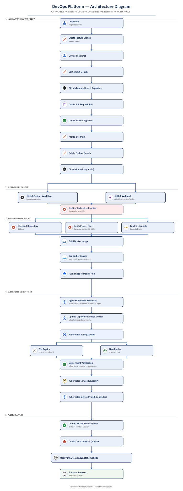
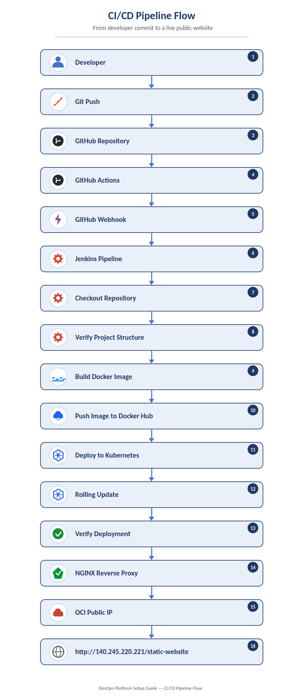

#  End-to-End DevOps CI/CD Pipeline for Static Website Deployment


---

##  Project Overview

This project demonstrates a complete **end-to-end DevOps CI/CD pipeline** for deploying a static website using modern DevOps tools and best practices.

The entire deployment process is fully automated, beginning from source code development and ending with a publicly accessible application hosted on **Oracle Cloud Infrastructure (OCI)**.

The pipeline includes:

- Feature Branch Workflow
- Pull Request based development
- GitHub Actions repository validation
- Jenkins Declarative Pipeline
- Docker image build and versioning
- Docker Hub image publishing
- Kubernetes deployment
- Rolling updates
- NGINX reverse proxy
- Public deployment on Oracle Cloud Infrastructure

---

#  Solution Architecture

> **Architecture Diagram**

<p align="center">
    
</p>

---

#  CI/CD Pipeline Flow

> **Pipeline Execution Flow**

<p align="center">
    
</p>

---

#  Technology Stack

| Category | Technology |
|-----------|------------|
| Version Control | Git |
| Source Repository | GitHub |
| CI Validation | GitHub Actions |
| Continuous Delivery | Jenkins |
| Containerization | Docker |
| Container Registry | Docker Hub |
| Container Orchestration | Kubernetes (Minikube) |
| Reverse Proxy | NGINX |
| Cloud Platform | Oracle Cloud Infrastructure (OCI) |
| Operating System | Ubuntu Server |

---

#  Project Structure

```
devops-poc-01
│
├── docker
│   ├── Dockerfile
│   ├── nginx.conf
│   └── .dockerignore
│
├── kubernetes
│   ├── namespace.yaml
│   ├── deployment.yaml
│   ├── service.yaml
│   └── ingress.yaml
│
├── website
│   ├── index.html
│   ├── style.css
│   └── assets/
│
├── docs
│   ├── architecture_diagram.png
│   └── cicd_pipeline_flow.png
│
├── Jenkinsfile
├── .gitignore
└── README.md
```

---

#  Git Workflow

This project follows a Feature Branch workflow.

```
Developer
      │
      ▼
Create Feature Branch
      │
      ▼
Develop Features
      │
      ▼
Commit & Push
      │
      ▼
Create Pull Request
      │
      ▼
Review & Approval
      │
      ▼
Merge into Main
      │
      ▼
Delete Feature Branch
```

---

#  CI/CD Pipeline Workflow

Once changes are merged into the **main** branch:

1. GitHub Actions validates the repository.
2. GitHub Webhook automatically triggers Jenkins.
3. Jenkins checks out the latest source code.
4. Project structure is verified.
5. Docker image is built.
6. Docker images are tagged.
7. Images are pushed to Docker Hub.
8. Kubernetes manifests are applied.
9. Deployment image is updated.
10. Kubernetes performs a rolling update.
11. Deployment status is verified.
12. Application is exposed through Kubernetes Ingress.
13. Ubuntu NGINX reverse proxy forwards external traffic.
14. Website becomes publicly accessible.

---

#  Docker Image Versioning

Every successful Jenkins build generates two Docker image tags.

```
latest

build-1
build-2
build-3
...
build-N
```

Example

```
nivedhapm/poc1:latest

nivedhapm/poc1:build-15
```

---

#  Kubernetes Resources

The deployment consists of the following Kubernetes resources.

| Resource | Purpose |
|----------|----------|
| Namespace | Logical isolation |
| Deployment | Application Pods |
| Service | Internal networking |
| Ingress | HTTP routing |

Deployment Configuration

- 2 Replicas
- Rolling Update Strategy
- ImagePullPolicy Always
- Automatic Image Updates

---

#  Rolling Update

Every new deployment updates the application without downtime.

```
Old Pods
     │
     ▼
Create New Pods
     │
     ▼
Health Check
     │
     ▼
Terminate Old Pods
     │
     ▼
Deployment Complete
```

---

#  Public Deployment

The application is publicly available through

```
Oracle Cloud VM
        │
        ▼
Ubuntu NGINX
        │
        ▼
Kubernetes Ingress
        │
        ▼
Kubernetes Service
        │
        ▼
Application Pods
```

Public URL

```
http://140.245.220.221/static-website
```

---

#  Jenkins Pipeline Stages

The Jenkins Declarative Pipeline performs the following stages.

- Checkout Repository
- Verify Project Structure
- Build Docker Image
- Tag Docker Images
- Push Image to Docker Hub
- Apply Kubernetes Resources
- Update Deployment Image
- Wait for Rolling Update
- Verify Deployment

---

#  Key Features

- Feature Branch Workflow
- Pull Request Based Development
- GitHub Actions Validation
- Automatic Jenkins Trigger
- Docker Image Build Automation
- Docker Hub Integration
- Kubernetes Deployment Automation
- Rolling Updates
- Automatic Deployment Verification
- Kubernetes Ingress Routing
- Ubuntu NGINX Reverse Proxy
- Oracle Cloud Public Deployment

---

#  Project Screenshots

## Git Feature Branch

<p align="center">
    
</p>

---

## Pull Request

<p align="center">
    
</p>

---

## GitHub Actions

<p align="center">
    
</p>

---

## Jenkins Pipeline

<p align="center">
    
</p>

---

## Docker Hub Repository

<p align="center">
    
</p>

---


## Kubernetes Deployment

<p align="center">
    
</p>

---

## Public Website

<p align="center">
    
</p>

---

#  Learning Outcomes

This project demonstrates practical experience with

- Git Feature Branch Workflow
- Pull Request Based Development
- GitHub Repository Management
- GitHub Actions
- Jenkins Declarative Pipelines
- Docker Image Creation
- Docker Image Versioning
- Docker Hub Registry
- Kubernetes Deployments
- Kubernetes Services
- Kubernetes Ingress
- Rolling Updates
- NGINX Reverse Proxy
- Public Cloud Deployment
- CI/CD Pipeline Automation
- DevOps Troubleshooting

---

#  Author

**Nivedha P M**

---